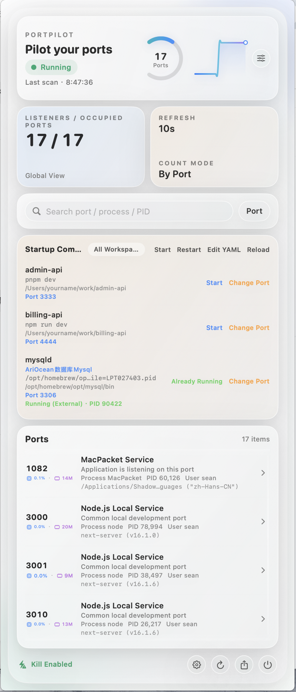
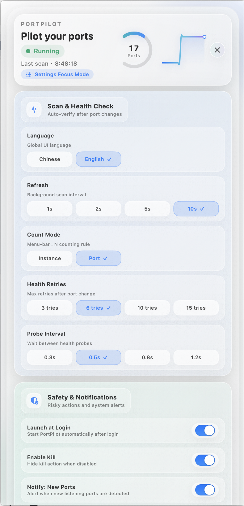

# PortPilot

**Pilot your ports**

PortPilot 是一个面向 macOS 15+ 的菜单栏端口监控工具，使用 **SwiftUI + MenuBarExtra** 实现，无第三方运行时依赖。  
PortPilot is a macOS 15+ menu bar port monitor built with **SwiftUI + MenuBarExtra**, with zero third-party runtime dependencies.

## Screenshot / 截图

> UI preview renders (文档预览图)





## Roadmap / 更新计划

- User-facing weekly roadmap: [docs/ROADMAP.md](docs/ROADMAP.md)
- We update progress weekly starting on **2026-03-09**.

## 中文

### 功能亮点
- 核心亮点：将正在运行的进程一键“保存为启动命令”，后续可在菜单栏快速启动/停止/重启
- 菜单栏摘要：`: N`（支持失败阈值后 `: —`）
- 实时扫描：`lsof -nP -iTCP -sTCP:LISTEN`
- 端口列表：Port / Process / PID / User / 友好用途说明
- 进程增强信息：PPID / 父进程 / 启动来源（launchd、brew、docker、ssh）
- 搜索与排序：按端口/进程/最近活动
- 新条目高亮（5 秒）
- 资源徽标：每进程 CPU / 内存
- 右键操作：复制 URL、PID、kill 命令
- 启动命令管理：YAML 配置、一键启动/停止/重启、改端口、冲突修复建议
- Workspace 场景：通过 `tags: ["workspace:xxx"]` 分组命令并按场景一键启停
- 开机启动：可在设置中开启登录后自动启动
- 诊断增强：导出监听、命令配置、运行事件、系统环境诊断包（JSON）
- 全局语言切换：中文 / English

### 我们实现了什么 / 解决了什么
- 为“同时开发多个后端项目”的日常场景，提供菜单栏内的一站式可视化管理
- 不再依赖多个终端窗口记命令：启动、停止、重启、改端口都可在 GUI 完成
- 支持把临时运行命令沉淀为可复用配置：从“这次能跑”变成“下次一键跑”
- 把冷冰冰的端口信息转成可读语义：用途说明、别名、来源、父进程链
- 降低端口冲突排障成本：冲突识别、可用端口建议、健康检查与诊断导出
- 安全默认优先：命令行默认隐藏、Kill 默认关闭且二次确认

### 安全默认
- `Show command line` 默认关闭
- `Enable Kill` 默认关闭
- Kill 需显式开启，并且每次操作前二次确认

### 运行要求
- macOS 15+
- Xcode 16+

### 本地运行
1. 打开 `PortPilot.xcodeproj`
2. 选择 Scheme：`PortPilot`
3. 运行：`⌘R`

若当前仍指向 Command Line Tools：

```bash
sudo xcode-select -s /Applications/Xcode.app/Contents/Developer
```

### 分发打包（无需用户安装 Xcode）
- 普通打包（本地签名）：`./scripts/package_release.sh`
- 产物：`dist/PortPilot-<version>.dmg` 和 `dist/PortPilot-<version>.zip`

### Developer ID 签名 + Notarization（推荐公开分发）
1. 配置 notary 凭据（一次即可）：
   - `./scripts/setup_notary_profile.sh PortPilotNotary`
2. 执行签名 + 公证 + 装订：
   - `DEV_ID_APP_CERT='Developer ID Application: Your Name (TEAMID)' NOTARY_PROFILE='PortPilotNotary' ./scripts/package_notarized_release.sh`
3. 产物与日志：
   - `dist/PortPilot-<version>.dmg`
   - `dist/PortPilot-<version>.zip`
   - `dist/notary-app-<version>.json`
   - `dist/notary-dmg-<version>.json`

### 设置项（内置面板）
- 语言：中文 / English
- 刷新频率：1 / 2 / 5 / 10 秒
- 计数模式：按实例（port+pid）/ 按端口（port only）
- 显示命令行（默认 OFF）
- 显示资源徽标（默认 ON）
- 自动建议启动项（默认 ON）
- 开机启动（默认 OFF）
- Enable Kill（默认 OFF）
- 忽略端口 / 忽略进程 / 进程别名
- 通知：新端口 / 端口冲突 / 扫描异常

### 发布前检查清单（Release Checklist）
- 构建检查：`./scripts/package_release.sh`
- 签名公证（可选）：`./scripts/setup_notary_profile.sh` + `./scripts/package_notarized_release.sh`
- 敏感信息检查：确认仓库不包含 `.env`、私钥、Token、个人证书文件
- 产物检查：`dist/PortPilot-<version>.dmg` 和 `dist/PortPilot-<version>.zip`
- Gatekeeper（有证书时）：`spctl -a -vv --type execute PortPilot.app`
- 文档检查：截图、功能列表、版本说明与实际一致

---

## English

### Highlights
- Core differentiator: one-click “Save as startup command” from live processes, then quick start/stop/restart from menu
- Menu bar summary: `: N` (falls back to `: —` after failure threshold)
- Real-time scan via `lsof -nP -iTCP -sTCP:LISTEN`
- Port list: Port / Process / PID / User / friendly usage hints
- Process enrichment: PPID / parent process / launch source (launchd, brew, docker, ssh)
- Search + sort: by port / process / recent activity
- “New” badge for 5 seconds
- Resource badges: per-process CPU / memory
- Context menu: copy URL, PID, kill command
- Startup command management: YAML-driven profiles, one-click start/stop/restart, port rebinding, conflict-fix suggestions
- Workspace scenes: group commands via `tags: ["workspace:xxx"]` and control by workspace
- Launch at login: optional setting to start automatically after login
- Enhanced diagnostics: export listeners, command config, runtime events, and system environment (JSON)
- Global language switch: Chinese / English

### What We Built / What It Solves
- A menu-bar-first control center for developers running many local backend services at once
- Removes terminal command memorization for daily ops (start/stop/restart/rebind port) in one GUI
- Converts ad-hoc local commands into reusable startup profiles, so “it works once” becomes “it starts anytime”
- Turns raw process/port data into readable context (purpose labels, aliases, source, parent chain)
- Speeds up conflict troubleshooting with conflict detection, suggested free ports, health checks, and diagnostics export
- Keeps security as default behavior (command line hidden by default, kill disabled by default, confirmation required)

### Secure by default
- `Show command line` is OFF by default
- `Enable Kill` is OFF by default
- Kill is opt-in and always requires confirmation

### Requirements
- macOS 15+
- Xcode 16+

### Run locally
1. Open `PortPilot.xcodeproj`
2. Select scheme `PortPilot`
3. Run with `⌘R`

If your machine still points to Command Line Tools:

```bash
sudo xcode-select -s /Applications/Xcode.app/Contents/Developer
```

### Distribution build (users don't need Xcode)
- Standard package (local signing): `./scripts/package_release.sh`
- Output: `dist/PortPilot-<version>.dmg` and `dist/PortPilot-<version>.zip`

### Developer ID signing + notarization (recommended)
1. Store notary credentials (one-time):
   - `./scripts/setup_notary_profile.sh PortPilotNotary`
2. Run signed + notarized release:
   - `DEV_ID_APP_CERT='Developer ID Application: Your Name (TEAMID)' NOTARY_PROFILE='PortPilotNotary' ./scripts/package_notarized_release.sh`
3. Outputs and logs:
   - `dist/PortPilot-<version>.dmg`
   - `dist/PortPilot-<version>.zip`
   - `dist/notary-app-<version>.json`
   - `dist/notary-dmg-<version>.json`

### Settings (integrated panel)
- Language: Chinese / English
- Refresh interval: 1 / 2 / 5 / 10 seconds
- Count mode: by instance (port+pid) / by port (port only)
- Show command line (default OFF)
- Show resource badges (default ON)
- Auto suggest startup profiles (default ON)
- Launch at login (default OFF)
- Enable Kill (default OFF)
- Ignore ports / ignore processes / process aliases
- Notifications: new ports / port conflicts / scanner failures

### Release checklist
- Build check: `./scripts/package_release.sh`
- Signed + notarized build (optional): `./scripts/setup_notary_profile.sh` + `./scripts/package_notarized_release.sh`
- Secrets check: ensure no `.env`, private keys, tokens, or personal certificates are tracked
- Artifact check: `dist/PortPilot-<version>.dmg` and `dist/PortPilot-<version>.zip`
- Gatekeeper verification (with cert): `spctl -a -vv --type execute PortPilot.app`
- Docs check: screenshots, feature list, and release notes match actual behavior

---

## How it works
1. `LsofRunner` executes `lsof` in background.
2. `LsofParser` loosely parses output and extracts listeners.
3. `PortsScanner` handles periodic scanning and failure state.
4. `PortsStore` manages dedupe, sort, and new-item lifecycle.
5. `PortsView` renders the integrated menu panel UI.

## Project structure

```text
PortPilot/
  PortPilotApp.swift
  Model/
    PortListener.swift
  Services/
    LsofRunner.swift
    LsofParser.swift
    PortsScanner.swift
    ProcessActions.swift
  State/
    CommandProfilesStore.swift
    PortsStore.swift
    SettingsStore.swift
  UI/
    PortsView.swift
    SettingsView.swift
  Resources/
    Info.plist
```

## License
MIT. See `LICENSE`.

## Contributing
See `CONTRIBUTING.md`.
